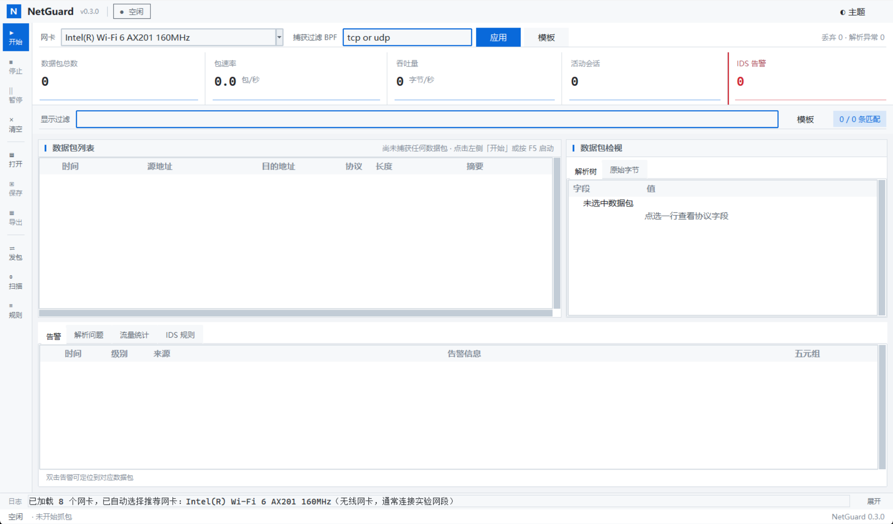
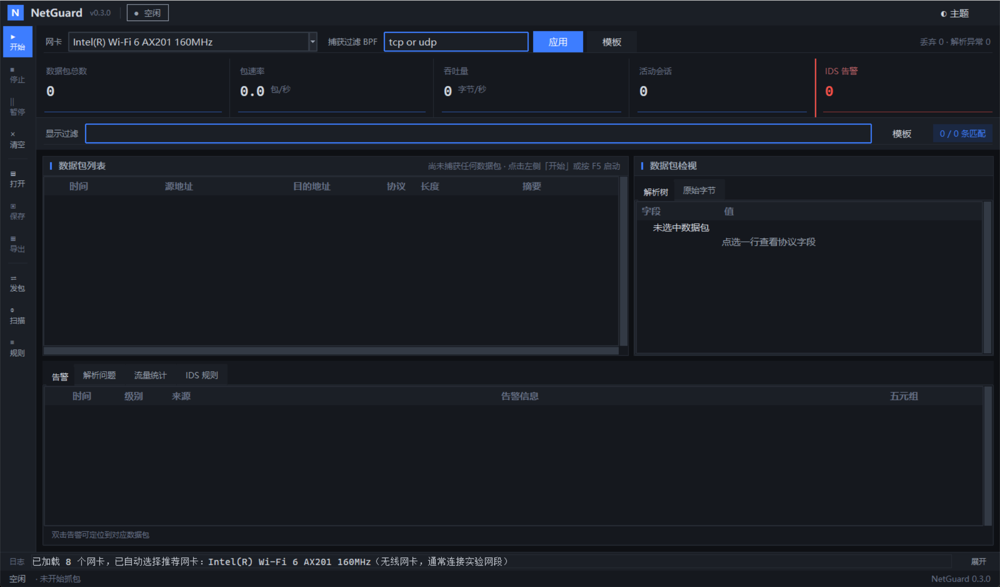

# NetGuard

[](https://github.com/NeverToEver/NetGuard/actions/workflows/tests.yml)
[](LICENSE)
[](https://www.python.org/downloads/)
[](pyproject.toml)

跨平台网络数据包监控与轻量 IDS 工具，参考 Wireshark 工作方式设计。

支持 Linux、macOS、Windows（Npcap/WinPcap），纯 Python 标准库实现（零运行时依赖）。

## 功能概览

- **抓包引擎** — `ctypes` 调用原生 libpcap / Npcap / WinPcap，枚举网卡、混杂模式、BPF 过滤
- **离线 pcap** — 纯标准库读写 `.pcap` 文件，可回放实验、保存结果、与 Wireshark/tcpdump 交叉验证
- **协议解析** — 自解析 Ethernet → IPv4 → TCP/UDP → HTTP/DNS/ICMP，结构化错误处理
- **IDS 规则** — 类 Snort 语法，协议/端口/content 匹配，实时告警
- **攻击检测** — 跨包时间窗口检测 SYN flood、端口扫描、DNS 隧道、ICMP flood、暴力破解
- **会话重组** — TCP 乱序片段重组、流追踪、超时清理；内容规则可在重组流中匹配，防御拆包绕过
- **图形界面** — Tkinter：包列表、协议详情、十六进制视图、告警日志、统计面板、列排序、BPF/显示过滤
- **桌面交互惯例** — 菜单栏与快捷键、表格右键菜单与复制、窗口/布局记忆、悬停提示、跟随系统深浅色主题
- **结构化告警** — 告警可导出为 JSON（每行一条），便于对接 SIEM 或后续分析

## 架构

数据流：`capture/source → processing → pipeline(事件队列) → gui`。

```mermaid
flowchart LR
    subgraph capture["抓包层"]
        A["pcap.py<br/>ctypes 绑定<br/>libpcap/Npcap"]
        B["source.py<br/>CaptureSource<br/>抓包/回放线程"]
        C["pcap_file.py<br/>离线 pcap 读写"]
    end

    subgraph proc["处理层"]
        D["processing.py<br/>PacketProcessor"]
        E["parser/packet.py<br/>协议解码"]
        F["session/tracker.py<br/>TCP 会话重组"]
        G["statistics<br/>速率统计"]
        H["rules/engine.py<br/>IDS 规则引擎"]
        I["detection/<br/>时间窗口检测器"]
    end

    subgraph ui["界面层"]
        J["pipeline.py<br/>PacketPipeline<br/>事件队列"]
        K["gui/main_ui.py<br/>Tkinter 主窗口"]
    end

    A --> B
    C --> B
    B -->|raw_queue| D
    D --> E --> F --> H
    D --> G
    D --> I
    H --> J
    I --> J
    J -->|event_queue<br/>pump() 每 250ms| K
```

模块清单：

```
main.py                     入口点
src/netguard/
├── app.py                  参数解析，路由到 GUI 或 CLI 预览，处理 --read/--write/--alerts-json
├── pipeline.py             PacketPipeline 编排门面（start/stop/pump/status）
├── processing.py           PacketProcessor：解析→会话→统计→规则/检测（可独立测试）
├── clock.py                时钟抽象（支持注入 mock）
├── capture/
│   ├── pcap.py             ctypes 调用原生 libpcap/Npcap 后端
│   ├── source.py           CaptureSource：抓包/回放线程、原始包队列、丢包统计
│   ├── pcap_file.py        纯标准库 pcap 文件读写
│   └── interface_mapping.py 跨平台网卡显示与推荐
├── parser/
│   └── packet.py           Ethernet→IPv4→TCP/UDP→HTTP/DNS/ICMP 解码
├── rules/
│   ├── engine.py           IDS 规则引擎：解析、索引、匹配、流匹配
│   └── suggestions.py      规则建议
├── detection/
│   ├── base.py             Detector 协议
│   └── detectors.py        SYN flood / 端口扫描 / DNS 隧道 / ICMP flood / 暴力破解
├── session/
│   └── tracker.py          TCP 会话重组与流管理
├── statistics/
│   └── traffic_stats.py    滚动窗口速率统计
├── discovery/
│   └── subnet.py           网段扫描与主机解析
├── trafficgen.py           合成数据包模板（演示/测试/基准）
└── gui/
    ├── main_ui.py          Tkinter 主窗口（菜单、状态栏、右键菜单、快捷键）
    ├── config.py           应用配置读写与旧版迁移（~/.netguard_config.json）
    ├── theme.py            跨平台字体 + 明暗主题 + 跟随系统检测
    ├── widgets.py          悬停提示等通用控件
    └── view_models.py      显示格式化工具
```

## 界面与快捷键



<details>
<summary>深色主题</summary>



</details>

主窗口是一套「应用外壳 + 工作区」的布局：

- **顶栏**：品牌标识、抓包状态胶囊（空闲 / 抓包中 / 已暂停）、主题切换按钮。
- **左侧操作轨**：开始 / 停止 / 暂停 / 清空，打开与保存 pcap、导出告警，
  测试发包、网段扫描、规则生成；按钮随状态改变配色与可用性。
- **捕获工具条**：网卡选择、BPF 表达式、模板，右侧常驻丢弃与解析异常计数。
- **KPI 指标条**：数据包总数、包速率、吞吐量、活动会话、IDS 告警五张指标卡，
  每张卡带迷你走势图；告警卡以红色竖条突出。
- **显示过滤栏**：当前结果显示条数与匹配总数。
- **工作区**：左侧数据包列表，右侧「数据包检视」分「解析树 / 原始字节」两个视图。
- **底部标签页**：告警、解析问题、流量统计、IDS 规则，标题上带实时计数。
- **底栏**：一行日志（可展开）与状态栏。

数据包列表按协议着色，解析异常的包整行标红；告警表按严重度着色，
并区分「IDS 规则」命中与内置检测器告警。

| 快捷键 | 功能 |
| --- | --- |
| `F5` | 开始抓包 |
| `Shift+F5` | 停止抓包 |
| `Ctrl+P` | 暂停 / 恢复刷新 |
| `Ctrl+L` | 清空数据 |
| `Ctrl+O` | 打开 pcap |
| `Ctrl+S` | 保存 pcap |
| `Ctrl+E` | 导出告警 |
| `Ctrl+F` | 聚焦显示过滤框 |
| `Ctrl+C` | 复制选中数据包整行 |
| `Ctrl+Q` | 退出 |
| `F1` | 快捷键说明 |

其它交互惯例：

- **表格**：点击表头按列排序，再次点击切换升/降序（表头显示 ▲/▼）；右键菜单可复制摘要、整行、
  源→目的、十六进制，或用摘要快速筛选；双击告警/异常可定位到对应数据包。
- **主题**：视图 → 主题，可选浅色/深色/跟随系统；选择"跟随系统"时会定期检测系统深浅色并自动切换。
- **状态记忆**：窗口位置与大小、分隔条位置、列宽、排序状态、上次网卡与 BPF/显示过滤条件都会保存到
  `~/.netguard_config.json`，下次启动自动恢复。
- **对话框**：相对主窗口居中，`Esc` 取消；模板/规则建议对话框支持回车确认。
- **后台执行**：保存 pcap、导出告警、加载规则在后台线程完成，界面不会被大文件阻塞。

## 安装

```bash
# 创建虚拟环境（Python 3.11+）
python3 -m venv .venv
source .venv/bin/activate      # Linux/macOS
# .venv\Scripts\activate       # Windows

pip install -e .
```

Linux 额外依赖：
```bash
sudo apt-get install -y libpcap0.8 fonts-noto-cjk
```

macOS：系统自带 libpcap，无需额外安装。

Windows 额外依赖：
- 安装 [Npcap](https://npcap.com/#download)，勾选 "WinPcap API-compatible Mode"
- Python 自带 tkinter，无需额外安装

## 快速开始

```bash
# 列出可用网卡
python main.py --list-devices

# 启动 GUI
python main.py

# 命令行抓包预览（需管理员/sudo 权限）
sudo python main.py --no-gui --interface eth0 --bpf "tcp or udp"

# 离线回放 pcap（无需 libpcap，无需权限）
python main.py --read capture.pcap

# 抓包并保存 + 导出告警为 JSON
python main.py --no-gui --interface eth0 --write out.pcap --alerts-json alerts.json

# 从文件加载 IDS 规则（默认使用内置示例规则）
python main.py --read capture.pcap --rules my.rules --alerts-json alerts.json

# 性能与检测能力基准
python scripts/benchmark.py --markdown
```

## 一键启动

仓库根目录提供了一键启动脚本，会自动定位 Python 3.11+ 解释器（优先 `.venv`）并完成环境自检：

```bash
# Windows：双击 NetGuard.bat，或在命令行运行
NetGuard.bat                 # 启动 GUI
NetGuard.bat --list-devices  # 列出网卡
NetGuard.bat --check         # 仅做环境自检
NetGuard.bat --read capture.pcap

# Linux / macOS
./NetGuard.sh                # 启动 GUI
./NetGuard.sh --check
```

所有参数原样转发给 `main.py`。若本机没有 Python 3.11+，可用 `--setup` 自动创建 `.venv` 并安装：

```bash
python scripts/launch.py --setup          # 建 .venv + pip install -e .，然后启动
python scripts/launch.py --setup --no-run  # 只建环境，不启动
```

`--check` 会逐项报告 Python 版本、源码结构、包导入、抓包后端、图形界面、IDS 规则是否正常，
适合在换机/排障时先跑一遍。

启动脚本（自动检测解释器，最终都转交 `scripts/launch.py`）：

```bash
./scripts/run_netguard.sh            # Linux / macOS
.\scripts\run_netguard.ps1           # Windows PowerShell
.\scripts\run_netguard.bat --list-devices
```

## IDS 规则

```
alert tcp any any -> any 80 (content "GET"; msg "检测到 HTTP GET 请求";)
alert udp any any -> any 53 (content "example.com"; msg "检测到 DNS 查询";)
```

语法：`alert <proto> <src> <src_port> <-> <dst> <dst_port> (content "X"; msg "Y";)`

内容规则除单包匹配外，还会在 TCP 会话重组流中查找，因此把关键词拆分到多个
TCP 段（拆包绕过）仍会命中；同一会话内同一规则只告警一次。

## 攻击检测（跨包时间窗口）

除静态规则外，内置检测器用于发现单包无法判断的行为（阈值均可在构造时配置）：

| 检测器 | 判据 | 默认阈值 |
| --- | --- | --- |
| SYN flood | 窗口内同一 (目的IP, 端口) 的 SYN 数 | 5s / 100 |
| 端口扫描 | 窗口内同一源访问的不同目的端口数 | 10s / 20 |
| DNS 隧道 | 超长域名/标签，或同一后缀高频查询 | 10s / 50 |
| ICMP flood | 窗口内同一 (源, 目的) 的 ICMP Echo 数 | 5s / 100 |
| 暴力破解 | 窗口内发往 SSH/FTP/Telnet 等服务端口的 SYN 数 | 60s / 10 |

## 性能

合成流量下的基准数据（Windows 11 / Python 3.11.9，20 万包，500 条规则）：

| 项目 | 结果 |
| --- | --- |
| 协议解析吞吐 | 约 12.5 万 包/秒（约 8.3 MB/s） |
| 端到端流水线 | 约 4.9 万 包/秒 |
| 单包解析耗时 | 约 8.0 µs |
| 规则匹配（500 条） | 中位约 0.9 µs，P99 约 2.5 µs |
| 内存增量（5 万包） | 约 9.2 MB |
| 合成攻击场景检出 | 3 / 3 |
| 正常流量误报率 | 0.100% |

复现：`python scripts/benchmark.py --packets 200000 --rules 500 --markdown`
（详见 [docs/benchmark.md](docs/benchmark.md)）

> 表中数字与 `docs/benchmark-results.json` 同源。规则匹配在引入端口二级索引前
> 中位为 247 µs，上表为改造后实测值。

## 开发

```bash
# 安装开发依赖（ruff / mypy / pytest-cov / pre-commit）
pip install -e ".[dev]"

# 运行全部测试
python -m pytest tests/ -v

# 运行单个测试文件
python -m pytest tests/test_parser.py -v

# 带覆盖率（门槛 60%，配置见 pyproject.toml）
python -m pytest tests/ --cov=netguard --cov-report=term-missing

# 代码检查与格式化
python -m ruff check src tests scripts main.py
python -m ruff format src tests scripts main.py

# 类型检查（strict）
python -m mypy

# 安装 git 钩子，提交前自动执行上述检查
pre-commit install
```

CI 在 GitHub Actions 上运行 4 个任务：`lint`（ruff check + format check）、
`typecheck`（mypy strict）、`pytest`（Ubuntu / Windows / macOS × Python 3.11 / 3.12，
带覆盖率门槛）、`benchmark`（检出率与误报率回归门槛）。
详见 [CONTRIBUTING.md](CONTRIBUTING.md)。

## 打包

```bash
python3 scripts/build_unix_app.py --python-env .venv
```

生成 `dist/NetGuard-portable/`（Unix）或 `dist/NetGuard.app`（macOS）。

## 文档

文档索引见 [docs/README.md](docs/README.md)。

- [使用说明](docs/usage.md)
- [技术报告](docs/technical-report.md)
- [性能基准](docs/benchmark.md)
- [后续工作路线图](docs/roadmap.md)
- [贡献指南](CONTRIBUTING.md) · [变更记录](CHANGELOG.md)
- 安装：[Linux](docs/install-linux.md) · [macOS](docs/install-macos.md) · [Windows](docs/install-windows.md)
- 排查问题：[排障指南](docs/troubleshooting.md)
- 分发与评审：[Linux 可执行文件分发](docs/distribute-linux.md) · [历次代码审查](docs/reviews/)

## 使用边界

NetGuard 是网络诊断与安全分析工具，**只应在你拥有权限的设备、授权网段或自有测试环境中使用**。
抓包会捕获网络中的原始流量，可能包含账号、Token、内网地址与业务内容；未经授权监听他人网络或
设备在多数司法辖区属违法行为。

- 只监听授权网卡与授权网段，不要抓取公共网络或他人设备流量；
- 导出的 pcap 与告警日志属敏感数据，提交或分享前请人工检查；
- 仓库不应包含真实抓包文件、密钥或凭据。

进一步说明见 [技术报告 · 安全与使用边界](docs/technical-report.md#10-安全与使用边界)。

## License

[MIT](LICENSE)
